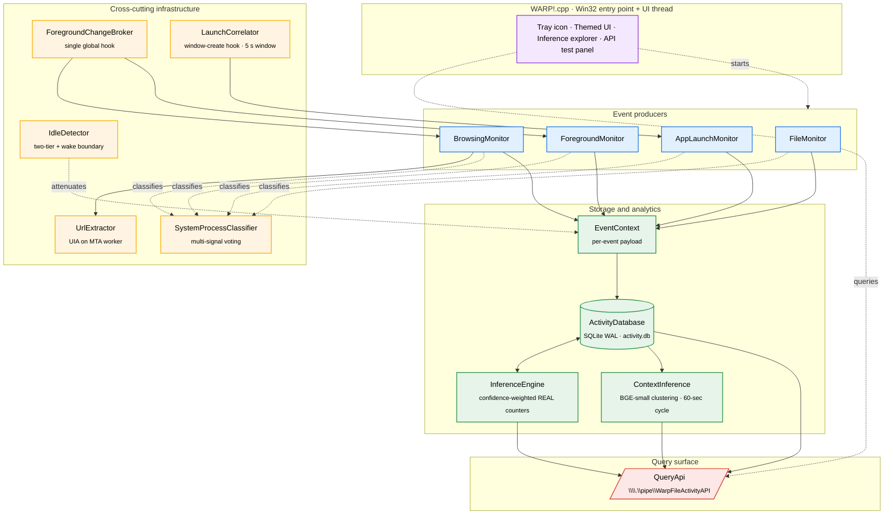
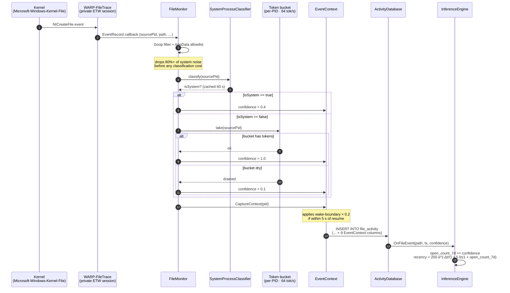
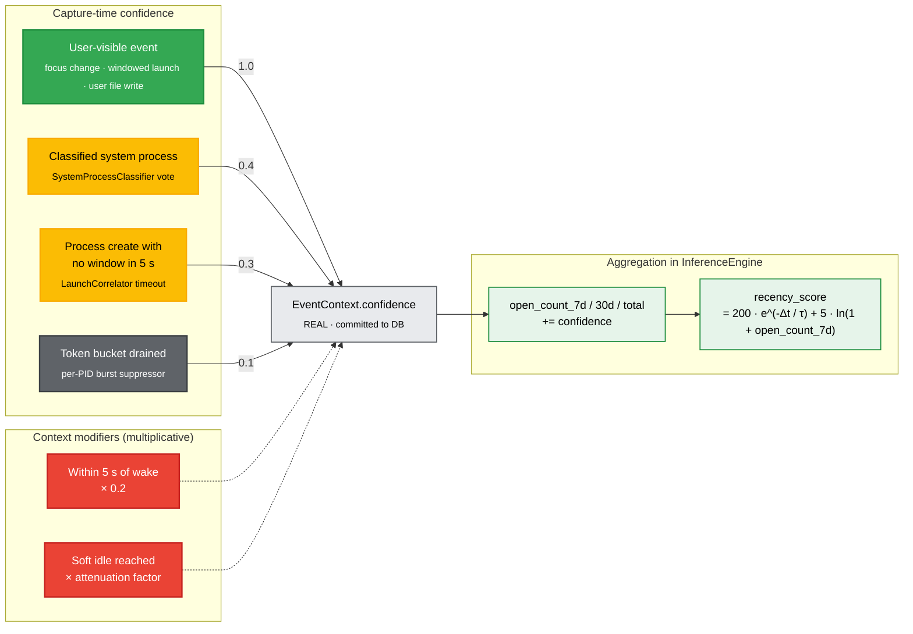
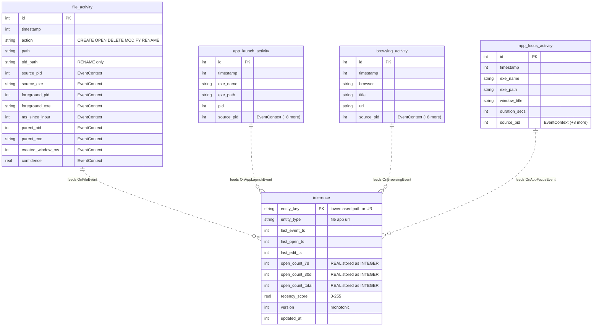

# WARP — Windows Activity Reasoning Platform

[](https://www.microsoft.com/windows/)
[](https://isocpp.org/)
[](https://visualstudio.microsoft.com/)
[](https://sqlite.org/)
[](#contextinference-contextinferenceh--contextinferencecpp)

WARP — the **Windows Activity Reasoning Platform** — is a lightweight Windows desktop
application that does two things on the local PC:

1. **Captures** raw desktop activity silently and continuously: file/folder activity,
   application launches, foreground app focus (with window titles and dwell time),
   and browsing activity. Everything is written to a rolling 30-day on-disk SQLite
   database and exposed through a queryable named-pipe API.

2. **Reasons** over that raw activity entirely on-device to produce structured,
   human-readable *context snapshots* of what the user is actually working on.
   A hybrid pipeline groups recent events into dynamic clusters, distils each
   cluster into a topic hint, then hands those hints to a small local LLM
   (**Qwen3-0.6B**, INT4, ONNX Runtime GenAI) that generates the final crisp
   English narrative for the overall session and for each facet (files,
   websites, apps). The narrative is then encoded by a sentence-embedding model
   (**granite-embedding-small-english-r2**, 384-dim ModernBERT) into a vector
   that ships alongside the text, so downstream consumers can do similarity
   search, deduplication, or clustering without re-running inference.

The result is exposed through the same named-pipe API: any application on the
machine can ask WARP "what is the user doing right now?" or "what were they
working on this morning?" and get back both the underlying events and an
inferred summary with a confidence score and an embedding vector.

The application starts minimized to the system tray (notification area), requires
administrator privileges, runs fully offline (no cloud calls, no telemetry leaving
the device), and is designed to run continuously in the background for as long as
the PC is actively being used.

---

## Table of contents

- [Features](#features)
- [Event types](#event-types)
- [Architecture](#architecture)
  - [System overview](#system-overview)
  - [Event-capture pipeline](#event-capture-pipeline)
  - [Noise-reduction & confidence pipeline](#noise-reduction--confidence-pipeline)
  - [Component overview](#component-overview)
- [Data model](#data-model)
- [User interface](#user-interface)
- [Building](#building)
- [Tech stack](#tech-stack)
- [Runtime behaviour](#runtime-behaviour)
- [Query API documentation](#query-api-documentation)
- [File layout](#file-layout)
- [License](#license)
- [Author](#author)

---

## Features

| Feature | Details |
|---|---|
| **System-tray residence** | Launches hidden; a light-bulb tray icon provides *Open* and *Exit* right-click menu items. Double-clicking the icon opens the window maximized. |
| **Administrator privileges** | The linker UAC setting requests `requireAdministrator`, so a UAC prompt is shown on launch. |
| **Modern themed UI** | Dark-on-light default theme with Segoe UI / Cascadia Mono fonts, owner-drawn buttons with rounded corners and accent borders, and a one-click **Dark Mode / Light Mode** toggle in the top-right corner. |
| **Built-in API test panel** | 9 predefined time-window buttons, a custom-seconds input field, and a default-query button -- all wired to the named-pipe API. Responses are pretty-printed as indented JSON in a scrollable monospace area. |
| **Event type filter checkboxes** | Four checkboxes (**File Activity**, **App Launches**, **App Focus**, **Browsing Activity**) control which event types are included in query results. All are checked by default. |
| **Two-tier idle / sleep awareness** | A *soft* threshold (default 2 min) downgrades event confidence; a *hard* threshold (default 5 min) pauses monitoring outright. Sleep / hibernate transitions trigger an immediate hard pause. On wake (and for 5 s after), `EventContext::SetWakeBoundary()` multiplies the producer's confidence by 0.2 to attenuate the burst of background I/O that follows resume. |
| **File-system monitoring** | Removable and network drives are watched recursively via `ReadDirectoryChangesW`. **Fixed drives no longer use RDCW** — they are covered exclusively by the ETW path (below) to eliminate the duplicate-event firehose that user-mode RDCW produced for system / cache / build directories. All paths are filtered through a comprehensive **goop exclusion list** (12 categories, 130+ patterns including Docker / WSL / OneDrive / Dropbox) and an explicit **AppData re-admit allowlist** (OneNote, Outlook, Sticky Notes, Visual Studio, Office UnsavedFiles, Notepad++ backup) that is checked *before* goop matching so genuine user files inside `\AppData\` survive. |
| **Shell-level monitoring** | `SHChangeNotifyRegister` on the entire shell namespace catches higher-level operations (copy, move, shell renames) that pure file-system notifications may miss. The same goop path exclusion is applied. |
| **ETW file monitoring (private session)** | A dedicated `WARP-FileTrace` private ETW session attaches to the manifested **Microsoft-Windows-Kernel-File** provider (no longer the shared NT Kernel Logger), so WARP cannot be starved by another consumer turning the global session off. Each event is enriched with the multi-signal `SystemProcessClassifier` (parent ancestry, image path, Authenticode subject, session, integrity, name pattern) and a per-PID **token bucket** (64 tokens / sec) — events that drain the bucket are downgraded to confidence 0.1 instead of being recorded as full-weight user activity. |
| **App launch monitoring (ETW + window correlation)** | New process launches arrive on a `WARP-ProcessTrace` private session attached to **Microsoft-Windows-Kernel-Process** (the 2 s polling loop is gone). Every PID is parked with `LaunchCorrelator`, which uses a `SetWinEventHook(EVENT_OBJECT_CREATE)` to wait up to 5 s for the launched process to create its first top-level visible window. Headless launches (services, COM surrogates, scheduled tasks, build steps) miss the window deadline and are emitted with confidence 0.3 — visible launches get confidence 1.0 and a `created_window_ms` value. The same `SystemProcessClassifier` runs in parallel as a redundant veto. |
| **Browsing activity monitoring** | The foreground window is no longer polled. `BrowsingMonitor` subscribes to `ForegroundChangeBroker`; when focus enters a recognised browser, a scoped per-PID `SetWinEventHook(EVENT_OBJECT_NAMECHANGE, …, pid, threadId, …)` is installed that fires on the actual title-bar update. URLs are extracted by `UrlExtractor` (UIA, MTA worker thread, bounded queue) so a hung browser process cannot block the message pump. |
| **Foreground app monitoring (event-driven)** | A single global `SetWinEventHook(EVENT_SYSTEM_FOREGROUND)` lives in `ForegroundChangeBroker` and fans out to every interested monitor. The 1 Hz `GetForegroundWindow()` poll is removed. When focus changes, the previous session's exe name, exe path, window title, and dwell time (seconds) are recorded; system / shell processes are excluded via the same `SystemProcessClassifier`. |
| **SQLite storage with EventContext** | All events are persisted in `%LOCALAPPDATA%\WARP\activity.db` using WAL mode across four tables. Every row carries a uniform **EventContext** payload — `source_pid`, `source_exe`, `foreground_pid`, `foreground_exe`, `ms_since_input`, `parent_pid`, `parent_exe`, `created_window_ms`, and `confidence` (REAL, default 1.0) — so downstream consumers can filter or weight events by the producer's user-intent estimate. Migration is idempotent (`ALTER TABLE … ADD COLUMN`); upgrading from an older WARP install does not require a fresh DB. |
| **30-day rolling eviction** | Records older than 30 days are deleted on startup and every 6 hours thereafter from all tables. Rolling window counts (`open_count_7d`, `open_count_30d`) in the inference engine are also recomputed on this schedule as `SUM(COALESCE(confidence, 1.0))` so noisy events contribute proportionally less to popularity ranking. |
| **Named-pipe query API** | Other Windows processes can connect to `\\.\pipe\WarpFileActivityAPI` and retrieve activity data as JSON for any supported time window, optionally filtered by event type. |
| **Confidence-weighted inference engine** | Every captured event incrementally updates per-entity inference records (files, apps, URLs) with open/edit timestamps and an exponential-decay recency score. Counters are accumulated by the producer's `confidence` (a REAL value in [0, 1]) rather than by `1`, so a stream of 10 events at confidence 0.1 contributes the same weight as one full-confidence event instead of being dropped wholesale by a hard threshold. JSON output rounds to integer via `llround()` so the documented integer `open_count_*` API contract still holds. Two dedicated API operations (`QueryInferences`, `GetInferenceDeltas`) let client apps retrieve these precomputed insights without scanning raw events. |
| **Inference explorer UI** | A built-in "Explore Precomputed Inferences" panel lets you browse the top-N entities ranked by recency score, filtered by entity type (Files / Apps / URLs), and look up the inference record for any specific path or URL -- all without leaving the WARP window. |
| **Dynamic context inference** | Every 60 seconds, all activities from the configured lookback window (default last 15 minutes; user-selectable from 5 minutes up to 30 days) are read directly from SQLite (with the user's *currently-active* foreground window overlaid as a virtual focus row, so even a single deep-work session is captured). A summarizer composes a human-readable **context summary** of 1–3 short phrase lines describing what the user is actively doing — e.g. `["Working on Context Inference (across Visual Studio & Edge)", "Discussing Daily Standup in Teams & Outlook", "Researching React Hooks"]`. The composer runs a layered classifier (exact exe table → path heuristics → fallback) plus a UTF-8-aware title cleaner that captures the *full* window title alongside a cleaned form. When the optional **granite (`ibm-granite/granite-embedding-small-english-r2`) ONNX sentence-encoder model** is present alongside the executable, per-app phrases are embedded and **dynamically clustered** (greedy, cosine ≥ 0.65) so semantically related activities (e.g. editing `auth.cpp` and reviewing the Auth PR in a browser) collapse into one *thread of work* — there is no fixed taxonomy of buckets. (The legacy `BAAI/bge-small-en-v1.5` and `all-MiniLM-L6-v2` ONNX models are automatically picked up as backward-compatibility fallbacks when the granite files aren't present; all three produce 384-dim embeddings — granite uses a byte-level BPE tokenizer that handles code/identifier tokens like `auth.cpp` and `useEffect` cleanly, while BGE and MiniLM share the older BERT WordPiece tokenizer.) For each cluster a **semantic theme** is then distilled by tokenizing the cleaned titles, filtering stop-words / file-extensions / brand names, and scoring the remaining content tokens by `focus-weighted coverage × (1 + cosine-to-clean-cluster-centroid)`; the top 1–3 tokens become the cluster's theme phrase. **Umbrella detection:** if a single content token appears in titles of ≥ 50 % of the top clusters AND those clusters carry ≥ 50 % of focus, those clusters are collapsed into a single descriptive line of the form `"Exploring <Umbrella> and its various aspects like <F1>, <F2> and <F3>"` (with a "Researching"-verb variant for browser-dominant umbrellas and a "Working on"-variant for editor-dominant ones). The combined "All" summary is hard-capped at 3 lines total and drops any non-umbrella cluster contributing less than 5 % of focus time, so each line stays *coherent* — no more `"… + 2 other threads"` noise. The verb is selected from a small set (`Working on`, `Reviewing`, `Researching`, `Reading about`, `Discussing`, `Writing`, `Exploring`, …) based on the dominant app type and content keywords. Without the model the engine still extracts themes by frequency alone (the verb logic is unchanged) and falls back to the verbatim title only when no usable content tokens remain. Each snapshot also carries a `confidence` score, a `dominant_focus_pct`, a `model` field (`"granite-embedding-small-english-r2"`, `"bge-small-en-v1.5"`, `"all-MiniLM-L6-v2"`, or `"deterministic"`), a `thread_count`, and a structured `items[]` breakdown — each item carries both the cleaned `title` and the **full** original `raw_title`, plus per-item `thread_id`. **Per-category facets:** in addition to the combined summary, the snapshot also carries three independent summaries — `summary_files` (any app where the user is engaged with a real file: `.docx` in Word, `.xlsx` in Excel, `.pptx` in PowerPoint, `.jpg`/`.png`/`.heic` in Photos / IrfanView / Paint, `.cpp`/`.json`/`.md`/`.txt` in any editor — recognized through both the file-app whitelist *and* title-based file-extension detection — plus recent file basenames from the file monitor), `summary_websites` (derived only from browser tab titles, aggregated per unique cleaned tab title), and `summary_apps` (derived only from non-file, non-browser apps: communications such as Outlook / Teams / Slack / Discord / WhatsApp / Zoom, media players, terminals, remote desktop) — each composed through the same sentence-encoder cluster→theme pipeline (including umbrella detection). The UI dropdowns next to the *Show Context Summary* / *Show Summary History* buttons let the user pick **which facet** (`All` / `Files` / `Websites` / `Apps`, default *All*) and **what lookback window** (5 min / 15 min / 30 min / 1 h / 2 h / 6 h / 24 h / 7 d / 15 d / 30 d, default *Last 15 minutes*). Snapshots refresh every minute; new entries are appended to history only on **material change** (different summary in *any* facet, different dominant app, or a 5-minute heartbeat). The latest snapshot is retrievable via `GetRecentContext` (with optional `category` and `window_seconds` parameters); the last *N* snapshots (default 10, max 200, newest-first) via `GetRecentContexts`. |

---

## Event Types

WARP captures three categories of events:

| Event Type | Description | Source |
|---|---|---|
| **File Activity** | User-initiated file/folder creates, opens, modifications, deletes, renames. System/goop paths excluded; per-PID classifier and token-bucket downgrade noisy producers. | ETW `Microsoft-Windows-Kernel-File` (private session) for fixed drives; `ReadDirectoryChangesW` for removable / network; `SHChangeNotifyRegister` |
| **App Launch** | Process creation events correlated against the appearance of a top-level visible window (5 s deadline). Headless launches downgraded to confidence 0.3. | ETW `Microsoft-Windows-Kernel-Process` (private session) + `LaunchCorrelator` (`SetWinEventHook(EVENT_OBJECT_CREATE)`) |
| **App Focus** | Foreground application sessions with window title and dwell time (seconds). System/shell processes excluded by `SystemProcessClassifier`. | `ForegroundChangeBroker` (single global `EVENT_SYSTEM_FOREGROUND` hook) |
| **Browsing Activity** | Browser page title changes (browser name, page title, URL). URL extracted via UI Automation, not parsed from the title bar. | `ForegroundChangeBroker` + scoped per-PID `EVENT_OBJECT_NAMECHANGE` hook + `UrlExtractor` (UIA on MTA worker thread) |

---

## Architecture

WARP is a single-process Win32 application built around four **event producers**, a
shared layer of **cross-cutting infrastructure** that classifies and contextualises
every event, and a **storage + analytics** layer that persists raw events and
maintains incrementally-updated per-entity inferences.

### System overview



### Event-capture pipeline

A canonical file-open event traces the following path from the kernel through
classification, context capture, and persistence to inference. The same shape
applies to launches, focus changes, and browsing events; only the *source* and
the producer-specific classification differ.



### Noise-reduction & confidence pipeline

Every event reaches `InferenceEngine` carrying a single `confidence` value in
`[0, 1]` that summarises *all* the signals WARP has about whether the event
came from the user. Confidence is assigned at capture time, then optionally
attenuated by two context modifiers before it is committed.



> **Why confidence-weighted aggregation matters:** the previous design used a
> hard `(confidence ≥ 0.5) ? 1 : 0` threshold, which dropped low-confidence
> events entirely. The new pipeline lets a stream of *n* events at average
> confidence *c* contribute *n × c* to the rolling counts, so a steady trickle
> of dim signal still surfaces in popularity ranking, just at a commensurate
> weight. JSON output rounds to integer via `llround()` so the documented
> integer `open_count_*` API contract still holds for clients.

### Component overview

Components fall into five logical groups: an **application shell**, four
**event producers**, the **cross-cutting infrastructure** they share, the
**storage and analytics** layer, and a single **query surface**.

> **Application shell**

#### `WARP!.cpp` -- Application shell & UI

The Win32 entry point. Creates the main window (opened maximized when restored from
tray) with a modern themed layout:

- **Header row** -- status label on the left, theme toggle and clear history buttons
  on the right, separated from the body by an accent-colored horizontal line.
- **Predefined query section** -- 9 owner-drawn buttons ("Last 15 min" through
  "Last 30 days") that wrap responsively based on window width.
- **Custom seconds section** -- a numeric edit field and "Send Custom Query" button.
- **Default query section** -- a single button that sends an empty `{}` request
  (returns last 1 hour).
- **Event type filter** -- four checkboxes (**File Activity**, **App Launches**,
  **App Focus**, **Browsing Activity**) that control which event types are queried.
  All checked by default. The selected types are sent as a `"types"` array in the
  JSON request.
- **Inference exploration section** -- labelled "Explore Precomputed Inferences":
  - *Entity type filter* -- three checkboxes (**Files**, **Apps**, **URLs**) to
    select which entity types to include. All checked by default.
  - *Top N* -- a numeric input (default 50) and a **Show Top Inferences** button
    that fetches all inference records via `GetInferenceDeltas`, filters by the
    selected entity types, sorts by `recency_score` descending, truncates to the
    top N, and formats a human-readable report with rank, type, score, open counts
    (7d / 30d / total), entity key, and local-time timestamps.
  - *Lookup* -- a text field with cue banner "Enter path or URL to look up..." and
    a **Lookup** button that sends a `QueryInferences` request for the entered
    entity key and displays the pretty-printed JSON result.
- **Response area** -- a read-only, scrollable, monospace (`Cascadia Mono`) edit
  control that displays pretty-printed JSON responses or the inference explorer
  output.

Each query button spawns a background thread that connects to
`\\.\pipe\WarpFileActivityAPI`, sends the appropriate JSON request, reads and
pretty-prints the response, then marshals it back to the UI thread via a custom
`WM_USER` message -- so the interface never freezes. After pretty-printing,
`AnnotateTimestamps()` walks the result line by line and appends a
`// YYYY-MM-DD HH:MM:SS` comment to any line that declares a known epoch-
seconds field (`timestamp`, `last_event_ts`, `last_open_ts`, `last_edit_ts`,
`updated_at`, `first_seen_ts`, `window_start`, `window_end`,
`created_window_ms`). Implausible values (zero, version numbers, recency
scores) are left untouched, and conversion uses `localtime_s` so the displayed
time matches the user's wall clock.

The UI supports two themes (**light** and **dark**) switchable at runtime via the
toggle button. All colors are defined in a `Theme` struct; switching recreates the
GDI brushes and issues a full `RedrawWindow` with `RDW_ALLCHILDREN`.

Closing or minimizing the window hides it back to the tray; only **Exit** from the
tray menu terminates the process.

> **Event producers**

#### `FileMonitor` (`FileMonitor.h` / `FileMonitor.cpp`)

Composite file-activity producer that reconciles three sources:

1. **ETW (`Microsoft-Windows-Kernel-File`, private session)** — owns *fixed*
   drives. The monitor opens its own `WARP-FileTrace` private session via
   `StartTraceW` + `EnableTraceEx2` so a misbehaving global consumer cannot
   starve it (older WARP shared the NT Kernel Logger, which any other tool
   could disable). Each event arrives on the consumer thread, is enriched
   with an `EventContext` (source/foreground/parent IDs, `ms_since_input`,
   `confidence`), then run through `SystemProcessClassifier` (cached
   per-PID) and a per-PID **token bucket** of 64 tokens / sec. Events that
   classify as system are dropped; events that drain the bucket are
   downgraded to confidence 0.1 instead of being dropped — so a real burst
   of user saves (e.g. a build finishing) still survives, just at lower
   weight.
2. **`ReadDirectoryChangesW`** — kept *only* for removable and network
   drives. The previous design ran RDCW on every fixed drive too, which
   double-counted every event with the ETW path and forced WARP to do all
   filtering in user mode. Fixed-drive RDCW is now removed.
3. **`SHChangeNotifyRegister`** — kept for shell-level operations (copy,
   move, shell renames) that the file-system layer alone cannot
   reconstruct.

Detected actions: **CREATE**, **OPEN**, **DELETE**, **MODIFY**, **RENAME**.

**Goop folder exclusion + AppData allowlist (all three paths):**

Every file path from all three sources is passed through `ShouldExclude()`,
which now (a) applies an explicit **AppData re-admit allowlist** *before*
goop matching so genuine user files inside `\AppData\` survive, then
(b) runs the goop filter. The allowlist covers OneNote (`OneNote\\…\.one`),
Outlook OST/PST under `\AppData\Local\Microsoft\Outlook\`, Sticky Notes
(`Microsoft.MicrosoftStickyNotes_*\…`), Visual Studio user settings,
Office UnsavedFiles, and Notepad++ backup. The goop filter itself
implements 12 categories:

| Category | Examples |
|---|---|
| **1. Windows OS directories** | `\Windows\` and all subdirectories |
| **2. Program Files** | `\Program Files\`, `\Program Files (x86)\` |
| **3. ProgramData** | `\ProgramData\` (entire tree) |
| **4. AppData** | `\AppData\` (entire tree -- caches, browser data, runtime state) |
| **5. Per-volume system folders** | `\System Volume Information\`, `\$Recycle.Bin\`, `\Recovery\`, `\$WINDOWS.~BT\`, `\$WINDOWS.~WS\`, `\$WINDOWS.~Q\`, `\$WinREAgent\`, `\$GetCurrent\`, `\$SysReset\`, `\Config.Msi\`, `\MSOCache\`, `\PerfLogs\`, `\DfsrPrivate\`, `\found.000\`–`\found.999\` (CHKDSK fragments) |
| **6. Developer toolchain** | `\node_modules\`, `\__pycache__\`, `\obj\`, `\bin\Debug\`, `\bin\Release\`, `\target\`, `\bower_components\`, `\CMakeFiles\`, `\Pods\`, `\venv\`, `\env\`, `\coverage\`, plus **all dot-prefixed folders** (`.git`, `.vs`, `.vscode`, `.cargo`, `.gradle`, `.nuget`, `.npm`, `.yarn`, `.conda`, etc.) |
| **7. User profile shell junctions** | `\Application Data\`, `\Local Settings\`, `\Cookies\`, `\NetHood\`, `\PrintHood\`, `\Recent\`, `\SendTo\`, `\Start Menu\`, `\Templates\`, `\My Documents\`, `\MicrosoftEdgeBackups\`, `\IntelGraphicsProfiles\` |
| **8. App caches by name pattern** | `\Cache\`, `\CacheStorage\`, `\Code Cache\`, `\GPUCache\`, `\DawnCache\`, `\GrShaderCache\`, `\ShaderCache\`, `\Crash Reports\`, `\CrashDumps\`, `\Crashpad\`, `\blob_storage\`, `\IndexedDB\`, `\Local Storage\`, `\Session Storage\`, `\Service Worker\`, `\WebStorage\`, `\databases\`, `\Logs\`, `\Log\`, `\Temp\`, `\Tmp\` |
| **9. OS upgrade/recovery** | `\Windows.old\`, `\OneDriveTemp\`, `\inetpub\` |
| **10. NTFS metadata** | `$MFT`, `$MFTMirr`, `$LogFile`, `$Bitmap`, `$Boot`, `$BadClus`, `$Secure`, `$UpCase`, `$AttrDef`, `$Extend` |
| **11. Container / WSL backing stores** | `\docker-desktop-data\`, `\wsl\…\ext4.vhdx`, `\Hyper-V\Virtual Machines\`, `\Containers\BaseImages\` |
| **12. Cloud-sync staging dirs** | `\OneDrive\…\.849C9593-…`, `\Dropbox\.dropbox.cache\`, `\Box\…\.box\`, `\Google\DriveFS\`, `\iCloudDrive\…\.icloud` |
| **13. PowerShell module discovery** | `\WindowsPowerShell\Modules\`, `\PowerShell\Modules\` (catches third-party `.psd1` / `.psm1` enumeration on shell startup, including OneDrive-synced user profiles such as `\Users\<u>\OneDrive - Org\Documents\WindowsPowerShell\Modules\…`) |

Additional file-level exclusions:

- **~70 file extensions** including `.exe`, `.dll`, `.sys`, `.tmp`, `.log`,
  `.pdb`, `.dat`, build artifacts, VM disk images, plus PowerShell framework
  files (`.psd1`, `.ps1xml`, `.psc1`, `.cdxml`, `.psrc`, `.pssc`) and .NET
  diagnostic outputs (`.nettrace`, `.gcdump`, `.netperf`).
- **System filenames** (`pagefile.sys`, `hiberfil.sys`, `NTUSER.DAT*`,
  `bootmgr`, etc.), Office lock files (`~$...`), and temp-file prefixes
  (`~...`).
- **.NET diagnostic tool prefixes**: `dotnet-diagnostic-{pid}`,
  `dotnet-trace-…`, `dotnet-dump-…`, `dotnet-counters-…`, `dotnet-gcdump-…`,
  `dotnet-stack-…`, `dotnet-monitor-…`, `dotnet-symbol-…`, `dotnet-sos-…`.
  These are emitted by .NET diagnostic IPC and CLI tooling, never by the
  user.
- **Generic diagnostic dump suffixes**: `*_diagnostics.json`,
  `*-diagnostics.json`, `*.diagnostics.json` — catches OpenTelemetry .NET
  auto-instrumentation drops (`OTEL_DIAGNOSTICS.json`), Azure SDK fault
  markers, and similar SDK-emitted dumps that land at the user profile root.

> **Note:** The goop exclusion applies **only to file activities**. App launch and
> browsing monitors are not affected by these path filters.

The monitor exposes `Pause()` / `Resume()` methods that the idle detector calls to
suspend event recording when the PC is hard-idle.

#### `AppLaunchMonitor` (`AppLaunchMonitor.h` / `AppLaunchMonitor.cpp`)

Subscribes to the **Microsoft-Windows-Kernel-Process** ETW provider via a
private `WARP-ProcessTrace` session, so every process create event is
delivered the moment the kernel emits it (no more 2 s `CreateToolhelp32Snapshot`
poll, which raced against short-lived processes that started and exited
between samples).

For each new PID the monitor:

1. Builds an `EventContext` from the source/parent metadata that the ETW
   record carries directly — no separate `OpenProcess` round trip needed.
2. Hands the PID to `LaunchCorrelator`, which "parks" it for up to 5 s
   while listening on `SetWinEventHook(EVENT_OBJECT_CREATE)` for the
   process's first top-level visible window. If a window appears the
   launch is emitted with `created_window_ms` populated and confidence
   1.0; if the deadline expires the launch is still emitted but with
   confidence 0.3 so headless launches (services, COM surrogates,
   scheduled-task workers, build-step children) ride at a fraction of
   the weight of user-visible launches instead of contaminating the
   "what apps did the user run" picture.
3. Runs the same `SystemProcessClassifier` used by `FileMonitor` as a
   redundant veto so well-known service ancestries are dropped even
   if they momentarily race a window onto the screen.

Every detected launch reports the executable name, full path, PID, and
the populated `EventContext`.

#### `BrowsingMonitor` (`BrowsingMonitor.h` / `BrowsingMonitor.cpp`)

Subscribes to `ForegroundChangeBroker`. When the foreground process is a
recognised browser, the monitor installs a **scoped** per-PID
`SetWinEventHook(EVENT_OBJECT_NAMECHANGE, …, pid, threadId, …)` so it
fires only when *that browser's* title bar updates — and tears the hook
down the moment focus leaves. This avoids the global NAMECHANGE
firehose (every IME composition, status-bar tick, and tooltip change in
the system) that a process-agnostic hook would deliver.

URLs are not parsed from the title bar (which is unreliable and locale-
dependent). Instead the monitor enqueues a request to `UrlExtractor`,
which uses **UI Automation** on a dedicated MTA worker thread to read
the actual address-bar `Value` property out of the browser. Because
UIA crosses process boundaries (and a hung browser can hang any UIA
caller), the extractor uses a bounded queue (32 entries; oldest dropped
on overflow) so the foreground broker thread never blocks.

Supported browsers: **Chrome**, **Edge**, **Firefox**, **Brave**,
**Opera**, **Vivaldi**, **Internet Explorer**.

Processing:
- Common browser suffixes ("- Google Chrome", "- Microsoft Edge", etc.) are stripped
  to extract the clean page title.
- The same `(browser, title)` combination is reported only once until the
  page changes.

#### `ForegroundMonitor` (`ForegroundMonitor.h` / `ForegroundMonitor.cpp`)

Subscribes to `ForegroundChangeBroker`. The previous 1 Hz
`GetForegroundWindow()` poll is gone — the broker delivers a
notification the moment Windows changes the foreground, with no
per-second wakeup cost when the user isn't actively switching apps.

When the foreground changes (different PID or different window title),
the previous session is emitted with:

- **exe_name** — executable filename (e.g. `OUTLOOK.EXE`).
- **exe_path** — full path to the executable.
- **window_title** — the window title that was active during the session.
- **duration_secs** — how many seconds the app was in the foreground.

Sessions shorter than 3 seconds are discarded. System / shell processes
are excluded via `SystemProcessClassifier` rather than a hard-coded
name list.

This monitor provides the **app usage context** (window titles and dwell time)
required by user-context scenarios such as improving search relevance based on
current app activity, inferring user intent from window titles, and tracking app
usage frequency and duration patterns over time.

> **Cross-cutting infrastructure**

#### `IdleDetector` (`IdleDetector.h` / `IdleDetector.cpp`)

A polling thread that checks `GetLastInputInfo` every 5 seconds and
manages **two thresholds**:

| Threshold | Default | What happens |
|---|---|---|
| **Soft** (`SetSoftIdleThreshold`) | 2 minutes | Fires `onSoftIdle`. Monitors keep running but `EventContext.confidence` for new events is attenuated, so events that fire during idle (Windows Update, Defender scans, telemetry uploads) contribute less weight to inference and ranking. |
| **Hard** (`SetHardIdleThreshold`) | 5 minutes | Fires `onHardIdle`. All four monitors are paused outright. |

A message-only window receives `WM_POWERBROADCAST` notifications
(`PBT_APMSUSPEND` / `PBT_APMRESUMEAUTOMATIC`) so sleep / hibernate
trigger an immediate hard pause regardless of input activity. On wake,
`EventContext::SetWakeBoundary()` is armed for 5 seconds — every event
captured during that window has its confidence multiplied by 0.2 so the
post-wake burst of background I/O (driver init, Defender catch-up,
sync clients reconnecting) does not look like a flood of user activity.

#### `EventContext` (`EventContext.h` / `EventContext.cpp`)

A shared value type that travels with every event from the producing
monitor through to `ActivityDatabase` and `InferenceEngine`. Fields:

| Field | Meaning |
|---|---|
| `sourcePid` / `sourceExe` | The process that actually performed the I/O or generated the event. |
| `foregroundPid` / `foregroundExe` | The user-facing process owning the foreground window at event time. |
| `parentPid` / `parentExe` | The parent of the source process (for ancestry checks). |
| `msSinceInput` | Milliseconds since the last keyboard / mouse / touch input from `GetLastInputInfo`. |
| `createdWindowMs` | For app launches: time from process create to first top-level visible window (set by `LaunchCorrelator`). |
| `confidence` | Producer's `[0, 1]` estimate that this event is user-initiated. Default 1.0. Attenuated by the soft-idle and wake-boundary multipliers, by the per-PID token bucket, and by `LaunchCorrelator` when no window appears in time. |

`EventContext::CaptureContext(pid)` populates a context for a given source
PID at event time and applies the wake-boundary multiplier (×0.2 if the
event lands inside the 5 s window after `SetWakeBoundary()` was armed).
`ActivityDatabase::BindEventContext()` binds the nine context fields onto
any prepared statement that has the columns appended in the standard
order.

#### `LaunchCorrelator` (`LaunchCorrelator.h` / `LaunchCorrelator.cpp`)

Bridges the gap between "process was created" and "user actually saw a
window". The correlator is started on the WARP UI thread (so it can use
`SetWinEventHook(WINEVENT_OUTOFCONTEXT)`, which requires a message
pump on the calling thread) and listens for `EVENT_OBJECT_CREATE` on
top-level windows. `AppLaunchMonitor` calls `Park(pid, callback)` when a
new PID arrives; the callback fires once with `created_window_ms` set
when a visible top-level window appears for that PID, or once with
`created_window_ms = -1` after a 5 s timeout. Headless launches fall in
the latter bucket and are emitted at confidence 0.3.

#### `SystemProcessClassifier` (`SystemProcessClassifier.h` / `SystemProcessClassifier.cpp`)

Replaces the old hard-coded "is this exe name in a 65-entry list"
checks. Each unknown PID is run through six independent signals:

1. **Parent ancestry** — service host (`services.exe`, `svchost.exe`,
   `wininit.exe`) anywhere in the chain.
2. **Image path** — `\Windows\System32\`, `\WinSxS\`, `\SystemApps\`,
   `\WindowsApps\`, `\Servicing\`, `\Windows\Temp\`, etc.
3. **Authenticode subject** — read via `WinVerifyTrust` +
   `CryptMsgGetParam` and matched against Microsoft Windows
   subjects (`Microsoft Windows`, `Microsoft Windows Publisher`,
   `Microsoft Corporation` for OS-signed binaries).
4. **Session ID** — session 0 is non-interactive by definition.
5. **Token integrity level** — System / High-mandatory in a
   non-interactive session is a strong system signal.
6. **Name pattern** — well-known noise patterns
   (`*svc.exe`, `*Host.exe`, `*Broker.exe`, `*Agent.exe` plus
   the explicit MsMpEng / SearchIndexer / SIHClient / WmiPrvSE list).

Each signal contributes a vote. A configurable threshold decides whether
the PID is "system" or "user". Results are cached per-PID with a 60 s
TTL. The point of this design is robustness to a single signal being
spoofed or unavailable — e.g. an unsigned binary running from
`\Users\Public\` that nonetheless lives in the service host ancestry is
still classified as system.

> Implementation note: `CertGetNameStringW` returns `const wchar_t*` for
> the buffer, so the Authenticode reader uses a `std::vector<wchar_t>`
> rather than `std::wstring::data()`.

#### `ForegroundChangeBroker` (`ForegroundChangeBroker.h` / `ForegroundChangeBroker.cpp`)

A single global `SetWinEventHook(EVENT_SYSTEM_FOREGROUND, …,
WINEVENT_OUTOFCONTEXT, …)` installed on the WARP UI thread.
Subscribers (`ForegroundMonitor`, `BrowsingMonitor`, anything else
that needs foreground transitions) register a callback via
`Subscribe()`; the broker invokes them all in order when the
foreground window changes. The broker eliminates the previous
1 Hz `GetForegroundWindow()` poll in `ForegroundMonitor` and the
3 s poll in `BrowsingMonitor`, plus the duplicated work of both
monitors asking the same question every interval.

#### `UrlExtractor` (`UrlExtractor.h` / `UrlExtractor.cpp`)

Asynchronous UI Automation client that reads the actual URL out of
browser address bars. Why not parse the title bar? Title bars are
locale-dependent, frequently empty (e.g. on `about:blank`), and
strip query strings — the address-bar `Value` property is the
ground truth. Why a worker thread? UIA crosses process boundaries
into the browser; if the browser is hung the calling thread blocks
indefinitely. The extractor:

- Runs on a dedicated worker thread that calls
  `CoInitializeEx(MULTITHREADED)` once and creates a single
  `IUIAutomation` instance.
- Accepts requests via a bounded queue (32 entries; drops the oldest
  on overflow) so a hung browser cannot back-pressure the
  foreground broker thread.
- For each request, walks the UIA tree from the top-level browser
  window, finds the address-bar `EditControl` (Chrome / Edge:
  `automation_id == "address-bar"` or class `Chrome_OmniboxView`;
  Firefox: `automation_id == "urlbar-input"`), and reads
  `Value.Value`.

Empty / failed extractions fall back to leaving the URL field NULL so
the title-only browsing event still records.

> **Storage and analytics**

#### `ActivityDatabase` (`ActivityDatabase.h` / `ActivityDatabase.cpp`)

A thread-safe SQLite wrapper. The database is stored at:

```
%LOCALAPPDATA%\WARP\activity.db
```

**Schema:** see the canonical [Data model](#data-model) section below for the
SQLite DDL and a corresponding ER diagram. The schema reflects four activity
tables that share a uniform 9-column **EventContext** suffix, plus a single
`inference` table that stores per-entity rolling counters.

**Pragmas:** `journal_mode=WAL`, `synchronous=NORMAL`.

**Eviction:** Records older than 30 days are deleted from all four event tables on
startup and every 6 hours via a `WM_TIMER`. Rolling window counts in the inference
engine (`open_count_7d`, `open_count_30d`) are also recomputed on this schedule via
`RefreshRollingCounts()`, which now `SUM(COALESCE(confidence, 1.0))` from the raw
event tables (rather than `COUNT(*)`) so the periodic resync agrees with the
per-event update path.

#### `InferenceEngine` (`InferenceEngine.h` / `InferenceEngine.cpp`)

A real-time analytics layer that maintains per-entity inference records across
three entity types: **files**, **apps**, and **URLs**.

Every time a raw event is written to the database, the corresponding monitor
callback also calls `OnFileEvent`, `OnAppLaunchEvent`, `OnAppFocusEvent`, or
`OnBrowsingEvent` on the inference engine. The engine:

1. Normalizes the entity key to lowercase UTF-8.
2. Loads or creates an `InferenceRecord` (in-memory cache backed by the `inference`
   SQLite table).
3. Adds the producer's `confidence` (a REAL value in `[0, 1]`) to the
   running counters `open_count_7d`, `open_count_30d`,
   `open_count_total`, and updates timestamps (`last_event_ts`,
   `last_open_ts`, `last_edit_ts`). The previous design used
   `(confidence >= 0.5) ? 1 : 0` and dropped low-confidence events
   entirely; the new design lets a stream of (n) events with average
   confidence c contribute (n × c) so a steady trickle of dim signal
   still surfaces in popularity ranking, just at a commensurate weight.
4. Recomputes a **recency score** using exponential decay:
   `score = 200 × e^(−Δt / 172800) + 5 × ln(1 + open_count_7d)`, capped at 255.
5. Bumps the record `version` and persists via `INSERT OR REPLACE`.

`RefreshRollingCounts()` (run on the 6-hour eviction schedule) recomputes
the rolling windows from the raw event tables as
`SUM(COALESCE(confidence, 1.0))` rather than `COUNT(*)`, so the periodic
resync agrees with the per-event update path. JSON serialisation rounds
the counters to integer via `llround()` so the documented integer
`open_count_*` API contract is preserved for existing clients.

Two query operations are exposed through the named pipe (see the
[Inference API](#5-inference-api) section below):

| Operation | Purpose |
|---|---|
| `QueryInferences` | Batch lookup of inference records by entity key, with optional field projection. |
| `GetInferenceDeltas` | Retrieve all records whose `version` exceeds a given watermark (up to 5 000 per call). |

Clearing the activity history (`ClearAll`) also clears the inference in-memory
cache via `ClearCache()`.

#### `ContextInference` (`ContextInference.h` / `ContextInference.cpp`)

A **dynamic, sentence-encoder-clustered** context summarizer that reads recent
activity directly from SQLite and composes a multi-line **context summary** (1-3 phrase lines)
describing what the user is actively doing — using the actual document names,
browser tab titles, and application titles observed, **not** a fixed list of
pre-defined topic buckets.

**Lifecycle:**

1. `Init(modelsDir)` — looks for `vocab.txt` + `bge-small.onnx` (BAAI/bge-small-en-v1.5)
   first under the directory passed in (typically `<exe>\models\`), then falls
   back to `%LOCALAPPDATA%\WARP\models`, and finally to the legacy
   `minilm.onnx` (all-MiniLM-L6-v2) for installations that haven't re-downloaded
   the model. If a model file + vocab are present, loads the
   `BertTokenizer` (WordPiece) and creates an ONNX Runtime session pinned to
   the CPU provider; otherwise the engine reports `model="deterministic"` and
   skips the embedding pass entirely. **Loading failure is never fatal.**
2. `Start(db, foregroundMonitor)` / `Stop()` — manages a background timer thread.
3. Every **60 seconds**, `RunOnce()` runs:
   - Pulls all file, app-launch, browsing, and **app-focus** activities from the
     last **15 minutes** via `ActivityDatabase`.
   - Overlays the user's **currently-active** foreground window via
     `ForegroundMonitor::GetCurrentSession()` — counted as a virtual focus row
     starting at `max(session_start, window_start)`. This fixes the blind spot
     where a user parked >15 minutes in one window would otherwise produce zero
     focus rows in the query.
   - Buckets activity per executable. For each exe, runs a **3-layer classifier**:
     1. **Exact match** against `kAppClasses[]` (~80 entries: Visual Studio, VS
        Code, Notepad++, JetBrains IDEs, Office apps, Outlook, Teams, Slack,
        browsers, PDF readers, notes apps, terminals, design tools, media
        players).
     2. **Path heuristic** for vendor folders (`\jetbrains\`, `\toolbox\apps\`,
        `\microsoft visual studio\`, `\code - insiders\`, `\microsoft office\`,
        `\microsoft\edge`, `\google\chrome`).
     3. **Fallback** — exe basename minus `.exe`, with the verb *"Working in"*.
   - Picks the **most recent / longest-dwell title** for each exe and runs it
     through `CleanTitle()`: normalises UTF-8 em-dash, en-dash, bullet, and `|`
     to ` - ` separators; strips leading status glyphs (●, `* `); pops trailing
     and leading segments matching the app's friendly name or the `kStripSuffixes`
     list (~50 noisy suffixes); and length-caps at 80 characters with a UTF-8
     ellipsis.
   - For browsers, the *cleaned active tab title* (from `BrowsingActivity`) takes
     precedence over the window title.
   - **Dynamic semantic clustering (sentence-encoder path).** The composed per-app phrase
     `<verb> "<title>" in <friendlyName>` for the top-8 ranked apps is fed
     through the WordPiece tokenizer and the BGE-small ONNX model
     (`BAAI/bge-small-en-v1.5`, 384-dim, ~33 M params; legacy
     `all-MiniLM-L6-v2` is supported as a drop-in fallback). Token embeddings
     are mean-pooled over real (non-pad) tokens and L2-normalised to a 384-dim
     sentence vector. A greedy single-pass clusterer compares each new vector
     to the centroid of every existing cluster and joins the first one with
     **cosine similarity ≥ 0.65**, otherwise opens a new cluster. The cluster
     centroid is updated as a running mean. There are **no pre-defined topic
     labels** — the threads of work emerge from whatever the user is actually
     doing in the rolling 15-minute window.
   - **Semantic theme extraction (per cluster).** For each cluster the
     cleaned member titles are tokenized into *content tokens* — split on
     whitespace, punctuation, **and camelCase** (`ContextInference` →
     `context` + `inference`); then filtered against a **stop-word** list
     (articles, low-information verbs / nouns, dates, generic UI words),
     a **file-extension** list (`cpp`, `docx`, `pdf`, …), and a **brand**
     list (`Visual Studio`, `Edge`, `GitHub`, `YouTube`, `PowerShell`, …
     — also matched on the *un-split* form so `YouTube` doesn't leak as
     `Tube`). Each surviving token is scored by
     `frequency × (1 + cosine(token-embedding, clean-cluster-centroid))`,
     where the *clean cluster centroid* is the sentence-encoder embedding of the
     joined content-token bag. The top **1–2** tokens (the second is
     dropped if its score is < 60 % of the first or if one is a prefix of
     the other) become the cluster's **theme phrase**, ordered by their
     first appearance and Title-Cased.
   - **Activity verb selection.** A small, fixed verb vocabulary —
     `Working on`, `Reviewing`, `Reading about`, `Researching`,
     `Discussing`, `Watching`, `Designing`, `Reading` — is chosen per
     cluster from the representative app type combined with content
     keywords (e.g. browser + `pull request` / `commit` / `diff` →
     `Reviewing`; browser + `tutorial` / `documentation` →
     `Reading about`).
   - **One-liner composition (semantic).** Each cluster contributes
     `<verb> <Theme Phrase>` (no quoted titles, no app names by
     default); when a cluster spans 2+ apps, a tail
     `(across App1, App2 & App3 + N more)` is appended so the
     consumer can still see *where* the work is happening. Clusters are
     joined by ` · ` with **adaptive top-N**: keep adding until 80 % of
     focus time is covered or the 180-character budget is reached, then
     append `+ N other thread(s)`. **Fallback:** if a cluster's title
     bag yields zero usable content tokens (all stop-words / brands),
     that cluster falls back to the prior verbatim format
     `<verb> "<title>" in <friendlyName>` so a context-free verb is
     never emitted. Without the sentence-encoder loaded the same theme
     extraction runs on frequency alone (no cosine weighting).
   - Computes a heuristic **confidence** score:
     `0.5 × min(1, focus_secs / 600) + 0.3 × (dominant_pct / 100) + 0.2 × min(1, signal_types / 3)`,
     capped at 0.99.
4. Snapshots (`ContextSnapshot`: timestamp, window bounds, summary,
   activity count, focus seconds, confidence, dominant percentage, signal types,
   `model`, `thread_count`, top-5 `items[]` each with `thread_id`) are stored in
   a rolling history buffer (up to 1 440 entries = ~24 hours at 60-sec cadence).
5. **Material-change dedup**: a new snapshot is appended to history only when (a)
   the summary differs from the last appended, **or** (b) the dominant
   exe changes, **or** (c) at least 5 minutes have elapsed since the last append.
   The "latest snapshot" pointer is refreshed unconditionally on every cycle.

The `GetRecentContext()` method returns the latest snapshot as JSON; the new
`GetRecentContexts(count)` method returns the last *N* snapshots, newest-first
(default 10, hard-capped at 200 to stay safely under the 64 KB pipe buffer). See
the [GetRecentContext](#getrecentcontext) and
[GetRecentContexts](#getrecentcontexts) API sections below.

> **Why a sentence-encoder for clustering instead of fixed buckets?** An
> earlier design used MiniLM to map every activity to one of ~50 hand-curated
> topic strings via cosine similarity. That hard-coded the user's possible
> contexts to a fixed taxonomy and lost the actual document/tab/app name in
> the result. The current design uses the sentence-encoder in the opposite
> direction: it does not classify — it *clusters* the literal phrases
> observed in the rolling window. Two activities are merged iff they are
> semantically similar to each other, not to a pre-defined list. The result
> is a richer, ground-truthful summary whose shape adapts to whatever the
> user is doing. If the model files are not shipped or fail to load, the
> engine still produces a per-app summary — it just no longer collapses
> related work into a single "thread".
>
> **Why BGE-small-en-v1.5 specifically?** `BAAI/bge-small-en-v1.5` is the
> CPU-friendly successor to MiniLM-L6-v2: same 384-dim output, same BERT
> WordPiece tokenizer (so no tokenizer change), but **+6.5 MTEB Clustering**
> (42.4 → 48.9) — directly relevant to WARP's short-text-clustering +
> theme-distillation workload. ~33 M params (vs. 22 M for MiniLM), ~3–5 ms
> per-title CPU latency at INT8, ~130 MB on disk. Installations with the
> legacy `minilm.onnx` continue to work transparently.

> **Query surface**

#### `QueryApi` (`QueryApi.h` / `QueryApi.cpp`)

A named-pipe server listening on:

```
\\.\pipe\WarpFileActivityAPI
```

The pipe is created with `PIPE_UNLIMITED_INSTANCES` so multiple clients can connect
concurrently. Each client connection is served on a detached thread.

The API accepts four kinds of requests:

1. **Event queries** — retrieve raw activity events for a time window, optionally
   filtered by event type via the `"types"` array. The response JSON is segregated
   by event type at the root level.
2. **`QueryInferences`** — batch lookup of precomputed inference records.
3. **`GetInferenceDeltas`** — incremental sync of inference records since a version
   watermark.
4. **`GetRecentContext`** — retrieve the latest context-summary snapshot from the
   `ContextInference` summarizer.
5. **`GetRecentContexts`** — retrieve the last *N* snapshots (newest first) from
   the `ContextInference` rolling history buffer.

Inference operations are routed to the `InferenceEngine` instance;
`GetRecentContext` and `GetRecentContexts` are routed to the `ContextInference`
instance; event queries are handled by `BuildJsonResponse` which reads directly
from `ActivityDatabase`.

---

## Data model

WARP persists every observation to a single SQLite database at
`%LOCALAPPDATA%\WARP\activity.db`. The model is intentionally narrow: four
**activity tables** (one per producer) that each carry the same 9-column
**EventContext** suffix, plus one **inference table** that holds rolling
per-entity counters derived from the activity tables.



The `inference` table is **not** maintained by SQLite triggers; the dotted
relationships above represent application-level callbacks fired by each
producer to `InferenceEngine::OnXxxEvent(...)` immediately after the raw
event is committed.

### EventContext suffix

Every activity table carries the same nine context columns, added on first
open via idempotent `ALTER TABLE ... ADD COLUMN` (SQLite's duplicate-column
error is silently swallowed, so upgrading from an older WARP install does
not require a fresh DB):

| Column              | Type    | Source                                        |
| ------------------- | ------- | --------------------------------------------- |
| `source_pid`        | INTEGER | PID that *caused* the event                   |
| `source_exe`        | TEXT    | Resolved image name for `source_pid`          |
| `foreground_pid`    | INTEGER | PID that owns the foreground window           |
| `foreground_exe`    | TEXT    | Resolved image name for `foreground_pid`      |
| `ms_since_input`    | INTEGER | `GetTickCount64() - GetLastInputInfo()`       |
| `parent_pid`        | INTEGER | Parent process of `source_pid`                |
| `parent_exe`        | TEXT    | Resolved image name for `parent_pid`          |
| `created_window_ms` | INTEGER | Time-to-first-window for the source process   |
| `confidence`        | REAL    | Per-event weight in `[0, 1]` (DEFAULT `1.0`)  |

### Canonical DDL

```sql
CREATE TABLE file_activity (
    id        INTEGER PRIMARY KEY AUTOINCREMENT,
    timestamp INTEGER NOT NULL,       -- Unix epoch seconds (UTC)
    action    TEXT    NOT NULL,        -- CREATE | OPEN | DELETE | MODIFY | RENAME
    path      TEXT    NOT NULL,        -- full path of the affected file/folder
    old_path  TEXT,                    -- previous path (RENAME only; NULL otherwise)
    -- EventContext (added to every activity table via idempotent ALTER):
    source_pid        INTEGER,
    source_exe        TEXT,
    foreground_pid    INTEGER,
    foreground_exe    TEXT,
    ms_since_input    INTEGER,
    parent_pid        INTEGER,
    parent_exe        TEXT,
    created_window_ms INTEGER,
    confidence        REAL DEFAULT 1.0
);

CREATE TABLE app_launch_activity (
    id        INTEGER PRIMARY KEY AUTOINCREMENT,
    timestamp INTEGER NOT NULL,
    exe_name  TEXT    NOT NULL,
    exe_path  TEXT    NOT NULL,
    pid       INTEGER NOT NULL
    -- + EventContext columns
);

CREATE TABLE browsing_activity (
    id        INTEGER PRIMARY KEY AUTOINCREMENT,
    timestamp INTEGER NOT NULL,
    browser   TEXT    NOT NULL,
    title     TEXT    NOT NULL,
    url       TEXT
    -- + EventContext columns
);

CREATE TABLE app_focus_activity (
    id            INTEGER PRIMARY KEY AUTOINCREMENT,
    timestamp     INTEGER NOT NULL,
    exe_name      TEXT    NOT NULL,
    exe_path      TEXT    NOT NULL,
    window_title  TEXT    NOT NULL,
    duration_secs INTEGER NOT NULL
    -- + EventContext columns
);

CREATE INDEX idx_activity_ts      ON file_activity(timestamp);
CREATE INDEX idx_activity_action  ON file_activity(action, timestamp);
CREATE INDEX idx_app_ts           ON app_launch_activity(timestamp);
CREATE INDEX idx_browse_ts        ON browsing_activity(timestamp);
CREATE INDEX idx_focus_ts         ON app_focus_activity(timestamp);
CREATE INDEX idx_file_src_pid     ON file_activity(source_pid);
CREATE INDEX idx_file_conf        ON file_activity(confidence);

-- Inference table (precomputed per-entity analytics).
-- open_count_* columns have INTEGER affinity but store REAL values
-- (SQLite's dynamic typing accepts REAL into INTEGER-affinity columns
-- losslessly; we read them back via sqlite3_column_double). They
-- accumulate the producer's `confidence` rather than counting events.
CREATE TABLE inference (
    entity_key        TEXT PRIMARY KEY,
    entity_type       TEXT,         -- 'file', 'app', or 'url'
    last_event_ts     INTEGER,
    last_open_ts      INTEGER,
    last_edit_ts      INTEGER,
    open_count_7d     INTEGER,      -- stores REAL; sum of confidence over 7 days
    open_count_30d    INTEGER,      -- stores REAL; sum of confidence over 30 days
    open_count_total  INTEGER,      -- stores REAL; lifetime sum of confidence
    recency_score     REAL,         -- 0-255 composite score
    version           INTEGER,      -- monotonic per-entity version
    updated_at        INTEGER
);

CREATE INDEX idx_inference_updated_at ON inference(updated_at);
CREATE INDEX idx_inference_version    ON inference(version);
```

### Retention

Records older than **30 days** are deleted from all four activity tables on
startup and every 6 hours via a `WM_TIMER`. The same timer runs
`InferenceEngine::RefreshRollingCounts()`, which recomputes `open_count_7d`
and `open_count_30d` as `SUM(COALESCE(confidence, 1.0))` over the raw event
tables — guaranteeing the periodic resync stays in lockstep with the
per-event update path.

---

## User interface

### Light mode (default)

The window opens maximized with a light grey background (`#F3F3F3`), dark text, and
white response panel. Buttons have soft grey fills with rounded corners and a blue
accent border on hover/press.

### Dark mode

Click the **Dark Mode** button in the top-right corner to switch. The background
becomes near-black (`#1E1E1E`), text turns light grey, buttons become charcoal with
accent borders, and the response area uses light blue text on a dark surface. Click
**Light Mode** to switch back. The toggle is instant -- all controls repaint
immediately.

### Layout

```
+------------------------------------------------------------+
| * Your friend WARP is ...     [ Clear History ] [Dark Mode] |
|------------------------------------------------------------|
| Query by Predefined Time Window                            |
| [Last 15 min] [Last 30 min] [Last 1 hour] [Last 2 hours]  |
| [Last 6 hours] [Last 24 hours] [Last 7 days] ...          |
|                                                            |
| Query by Custom Seconds                                    |
| [  300  ] [Send Custom Query]                              |
|                                                            |
| Query with Default (empty body -- returns last 1 hour)     |
| [Send Default Query]                                       |
|                                                            |
| Event Types to Query:                                      |
|   [x] File Activity  [x] App Launches  [x] App Focus      |
|   [x] Browsing Act.                                        |
|                                                            |
| Explore Precomputed Inferences                             |
| Entity Types: [x] Files [x] Apps [x] URLs  Top N: [50]    |
|                                  [Show Top Inferences]     |
| [Enter path or URL to look up...                ] [Lookup] |
|                                                            |
| [Show Context Summary]                                     |
|                                                            |
| API Response
| +--------------------------------------------------------+ |
| | {                                                      | |
| |   "file_activities": { ... },                          | |
| |   "app_launch_activities": { ... },                    | |
| |   "browsing_activities": { ... }                       | |
| | }                                                      | |
| +--------------------------------------------------------+ |
+------------------------------------------------------------+
```

All controls reflow when the window is resized. Minimum window size is 800 x 500.

---

## Building

**Prerequisites:**

- Visual Studio 2022 (v143 toolset)
- Windows 10 SDK (10.0 or later)
- C++14 standard
- NuGet (Visual Studio bundles this; CLI users can grab `nuget.exe` from
  <https://dist.nuget.org/win-x86-commandline/latest/nuget.exe>)

The project compiles SQLite as an embedded amalgamation (`sqlite3.c` / `sqlite3.h`)
and pulls **`Microsoft.ML.OnnxRuntime` 1.23.0** plus **`Microsoft.ML.OnnxRuntimeGenAI` 0.14.1**
via NuGet (declared in `packages.config`). The BGE-small sentence-encoder model files
and the Qwen3-0.6B polishing-model files are **not** committed to the repo — they are
downloaded once into a `models/` folder before the build.

**Steps:**

1. Open `WARP!.sln` in Visual Studio (or run `nuget restore "WARP!.sln" -PackagesDirectory ..\packages` from the repo root).
2. Download the sentence-encoder model files into `models/` (one-time, ~55 MB):

   ```powershell
   # Preferred: ibm-granite/granite-embedding-small-english-r2 (ModernBERT
   # byte-level BPE, 384-dim, COIR code-retrieval trained, Apache 2.0).
   $graniteDir = "models/granite"
   New-Item -ItemType Directory -Path $graniteDir -Force | Out-Null
   Invoke-WebRequest `
     -Uri "https://huggingface.co/onnx-community/granite-embedding-small-english-r2-ONNX/resolve/main/onnx/model_quantized.onnx" `
     -OutFile "$graniteDir/model_quantized.onnx"
   Invoke-WebRequest `
     -Uri "https://huggingface.co/onnx-community/granite-embedding-small-english-r2-ONNX/resolve/main/onnx/model_quantized.onnx_data" `
     -OutFile "$graniteDir/model_quantized.onnx_data"
   Invoke-WebRequest `
     -Uri "https://huggingface.co/ibm-granite/granite-embedding-small-english-r2/resolve/main/tokenizer.json" `
     -OutFile "$graniteDir/tokenizer.json"
   python -m pip install --quiet regex
   python scripts/extract_modernbert_tokenizer.py "$graniteDir/tokenizer.json" "$graniteDir"
   Remove-Item "$graniteDir/tokenizer.json" -Force

   # Optional legacy fallback (auto-used when granite/ isn't present):
   #   BAAI/bge-small-en-v1.5 (BERT WordPiece, 384-dim, ~130 MB).
   New-Item -ItemType Directory -Path models -Force | Out-Null
   Invoke-WebRequest `
     -Uri "https://huggingface.co/BAAI/bge-small-en-v1.5/resolve/main/onnx/model.onnx" `
     -OutFile "models/bge-small.onnx"
   Invoke-WebRequest `
     -Uri "https://huggingface.co/BAAI/bge-small-en-v1.5/resolve/main/vocab.txt" `
     -OutFile "models/vocab.txt"
   ```

   > **Granite is the preferred default** — `ContextInference::Init()` tries
   > `models/granite/` first, then falls through to `bge-small.onnx`, then
   > `minilm.onnx`, then deterministic mode. All three sentence-encoder
   > options output the same 384-dim space so the downstream cluster
   > threshold and theme/verb scoring are unchanged; only the granite
   > path uses `ModernBertTokenizer` (byte-level BPE) while the BGE / MiniLM
   > paths stay on the original `BertTokenizer` (WordPiece).

3. Download the **LLM "brain" model** (Qwen3-0.6B, CPU-INT4,
   ~430 MB) into `models/qwen/`.  This is the model that reads the
   raw window titles and generates the user-facing summary text;
   when present, its output replaces the algorithmic cluster->theme
   output in the `summary` field.  **Required on x64 and ARM64**
   — the CI build pipeline downloads it automatically and **bundles it
   into the release artifact** so end users don't have to.  For local
   development you'll need to fetch it yourself once:

   ```powershell
   New-Item -ItemType Directory -Path models\qwen -Force | Out-Null
   $repo = "https://huggingface.co/xiaoyao9184/Qwen3-0.6B-onnx-genai/resolve/main/cpu_and_mobile/cpu-int4-rtn-block-32-acc-level-4"
   foreach ($f in 'chat_template.jinja','genai_config.json','model.onnx','model.onnx.data','tokenizer.json','tokenizer_config.json') {
     Invoke-WebRequest -Uri "$repo/$f" -OutFile "models/qwen/$f"
   }
   ```

   **x86 builds skip this step entirely** — the
   `Microsoft.ML.OnnxRuntimeGenAI` NuGet only ships x64 and ARM64
   binaries.  The brain layer is graceful-degrade: when its model
   files or runtime DLL aren't present, `ContextInference` falls back
   to the algorithmic cluster->theme summary and reports
   `"model_polish": "(not loaded)"` in the response.

4. Build any configuration (Debug/Release × Win32/x64/ARM64).  The post-build
   `CopyOnnxRuntime` MSBuild target copies `onnxruntime.dll`,
   `onnxruntime-genai.dll` (x64/ARM64 only), and the `models/` folder
   (including `models/qwen/` on x64/ARM64) next to `WARP!.exe`
   automatically.

> **Skipping the granite model download is fine** — the binary will still
> build and run; `ContextInference::Init()` just falls through to the
> deterministic per-app composer and reports `"model": "deterministic"` in
> every snapshot.  The Qwen model download is **mandatory for x64 / ARM64
> CI builds** but optional for local development (the LLM brain simply
> stays disabled when its files are missing and the algorithmic summary
> path takes over).

---

## Tech stack

WARP is intentionally lean: a single Win32 executable that talks directly to
the operating system for capture, to embedded SQLite for persistence, and uses
the **granite (`ibm-granite/granite-embedding-small-english-r2`)** ModernBERT
ONNX sentence-encoder for *dynamic* context clustering (with `BAAI/bge-small-en-v1.5`
and `all-MiniLM-L6-v2` supported as transparent backward-compatibility
fallbacks) — no fixed taxonomy, no managed runtime, no service host, no
background broker.

```mermaid
flowchart TB
    classDef app   fill:#e1f0ff,stroke:#1a73e8,color:#000,stroke-width:1.5px
    classDef win   fill:#fff4e1,stroke:#f9ab00,color:#000,stroke-width:1.5px
    classDef store fill:#e6f4ea,stroke:#1e8e3e,color:#000,stroke-width:1.5px
    classDef ml    fill:#f3e8fd,stroke:#9334e6,color:#000,stroke-width:1.5px
    classDef ipc   fill:#fce8e6,stroke:#d93025,color:#000,stroke-width:1.5px

    subgraph App ["Application layer · C++17 · Visual Studio 2022 · /MT"]
        WARP["WARP.exe<br/><sub>single elevated Win32 process</sub>"]:::app
    end

    subgraph WinAPI ["Windows APIs (kernel + user mode)"]
        ETW["Event Tracing for Windows<br/><sub>Microsoft-Windows-Kernel-File / -Process</sub>"]:::win
        WIN_HOOKS["SetWinEventHook<br/><sub>EVENT_SYSTEM_FOREGROUND / OBJECT_CREATE / NAMECHANGE</sub>"]:::win
        UIA["UI Automation<br/><sub>address-bar value extraction</sub>"]:::win
        RDC["ReadDirectoryChangesW<br/><sub>removable / network drives</sub>"]:::win
        SHELL["SHChangeNotifyRegister<br/><sub>shell namespace fallback</sub>"]:::win
        IDLE["GetLastInputInfo<br/><sub>two-tier idle detection</sub>"]:::win
        TRUST["WinVerifyTrust + WinTrust<br/><sub>Authenticode subject lookup</sub>"]:::win
        TS["WTSQuerySessionInformation<br/><sub>session / integrity</sub>"]:::win
        PIPES["Named Pipes<br/><sub>\\\\.\\pipe\\WarpFileActivityAPI</sub>"]:::ipc
    end

    subgraph Storage ["Storage layer"]
        SQLITE["SQLite (amalgamation)<br/><sub>WAL · synchronous=NORMAL · single file</sub>"]:::store
        DB[("activity.db<br/><sub>%LOCALAPPDATA%\\WARP\\</sub>")]:::store
    end

    subgraph CTX ["Context inference layer"]
        CI["ContextInference<br/><sub>BGE-small dynamic clustering · in-process</sub>"]:::ml
        CLS["kAppClasses + path heuristics<br/><sub>~80 entries · 3-layer classifier</sub>"]:::ml
        TC["CleanTitle + ComposeOneLiner<br/><sub>UTF-8 normaliser · adaptive top-N</sub>"]:::ml
    end

    WARP --> ETW
    WARP --> WIN_HOOKS
    WARP --> UIA
    WARP --> RDC
    WARP --> SHELL
    WARP --> IDLE
    WARP --> TRUST
    WARP --> TS
    WARP --> PIPES

    WARP --> SQLITE
    SQLITE --> DB

    WARP --> CI
    CI   --> CLS
    CI   --> TC
```



| Layer            | Component                            | Purpose                                                                |
| ---------------- | ------------------------------------ | ---------------------------------------------------------------------- |
| **Application**  | C++17, Win32, Visual Studio 2022     | Single elevated process; static CRT (`/MT`); no service host           |
| **Capture**      | ETW (`Microsoft-Windows-Kernel-*`)   | File-open and process-create events from the kernel                    |
| **Capture**      | `SetWinEventHook`                    | Foreground changes, window-create correlation, browser tab title hooks |
| **Capture**      | UI Automation                        | Browser address-bar URL extraction on a dedicated MTA worker thread    |
| **Capture**      | `ReadDirectoryChangesW`              | File events on removable / network volumes (ETW excludes these)        |
| **Capture**      | `SHChangeNotifyRegister`             | Shell namespace fallback for files ETW cannot see                      |
| **Attribution**  | `GetLastInputInfo`                   | `ms_since_input` for soft-idle attenuation                             |
| **Attribution**  | WinTrust + WTS                       | Authenticode subject and session/integrity for system-process voting   |
| **IPC**          | Named pipes                          | Sync request/response API on `\\.\pipe\WarpFileActivityAPI`            |
| **Storage**      | SQLite (amalgamation, WAL)           | Embedded; one `activity.db` per user under `%LOCALAPPDATA%\WARP\`      |
| **Context**      | `ContextInference` (BGE-small clustering) | 60-sec rolling summarizer; emits a 1–3 line `summary` + clustered `items[]`        |
| **Context**      | `kAppClasses` + path heuristics      | 3-layer exe classifier (~80 known apps + JetBrains/Office/browsers)    |
| **Context**      | `CleanTitle` + `ComposeOneLiner`     | UTF-8 separator normaliser, suffix stripper, adaptive top-N composer   |

> **Why no service?** WARP runs interactively in the elevated user session so
> that `GetForegroundWindow`, `WTSGetActiveConsoleSessionId`, and UI
> Automation are all in-scope. A Session 0 service would lose foreground
> attribution and need an out-of-process broker to recover it — a much larger
> failure surface than a single elevated process.

---

## Runtime behaviour

1. On launch the app requests elevation (UAC prompt).
2. The main window is created but kept hidden; a light-bulb system-tray icon appears.
3. The SQLite database is opened (created if it doesn't exist), the
   EventContext columns are added to all activity tables via idempotent
   `ALTER TABLE`, and old records are evicted from all four tables.
4. `ForegroundChangeBroker` and `LaunchCorrelator` are started on the UI
   thread (both need a message pump for `SetWinEventHook`).
5. `FileMonitor` starts: a `WARP-FileTrace` private ETW session is opened
   against `Microsoft-Windows-Kernel-File` for fixed drives;
   `ReadDirectoryChangesW` threads start for removable / network drives;
   the shell-change subscription is registered. The goop filter and
   AppData allowlist are active from the first event.
6. `AppLaunchMonitor` opens a `WARP-ProcessTrace` private ETW session
   against `Microsoft-Windows-Kernel-Process`. Each new PID is parked
   with `LaunchCorrelator` and emitted with `created_window_ms` and
   confidence after the window correlation resolves.
7. `BrowsingMonitor` and `ForegroundMonitor` subscribe to
   `ForegroundChangeBroker`. `BrowsingMonitor` additionally starts the
   `UrlExtractor` worker thread.
8. `IdleDetector` starts polling `GetLastInputInfo` every 5 seconds and
   creates the `WM_POWERBROADCAST` listener window. Two thresholds are
   armed (soft attenuation, hard pause).
9. The inference engine is initialised with direct access to the SQLite
   database. Confidence-weighted rolling counts are recomputed from the
   raw event tables (`SUM(COALESCE(confidence, 1.0))`).
10. The named-pipe server starts accepting connections.
11. The context inference engine starts: it looks for `models/bge-small.onnx`
    (or, as a backward-compat fallback, `models/minilm.onnx`) plus
    `models/vocab.txt` next to the exe (or under `%LOCALAPPDATA%\WARP\models`)
    and, if found, loads the `BertTokenizer` plus an ONNX Runtime session
    pinned to the CPU provider for the discovered model
    (`bge-small-en-v1.5` or `all-MiniLM-L6-v2`). If the files are absent or
    the session fails to construct, the engine logs and falls through to
    deterministic per-app composition. Either way it begins its 60-second
    cycle.
12. Every detected event (file, app launch, app focus, or browsing) is
    enriched with an `EventContext` (source / foreground / parent ids,
    `ms_since_input`, `confidence`), inserted into the appropriate
    database table, **and** fed to the inference engine, which adds the
    event's confidence to the per-entity rolling counters.
13. Every 60 seconds, the context inference engine gathers all activities
    from the last 15 minutes (overlaying the currently-active foreground
    window as a virtual focus row), classifies and cleans them, embeds the
    per-app phrases (when the sentence-encoder is loaded), runs greedy clustering at
    cosine ≥ 0.65, and composes a context-summary snapshot. The snapshot is
    appended to the rolling history only on material change (different
    one-liner, different dominant app, or a 5-minute heartbeat).
14. Every 6 hours, records older than 30 days are purged from all event
    tables and inference rolling counts are recomputed.
15. When the user crosses the **soft** idle threshold, new events are
    captured at attenuated confidence. When they cross the **hard**
    threshold (or the PC sleeps), all monitors pause. On wake, all
    monitors resume but events captured within 5 s carry a 0.2× wake-
    boundary confidence multiplier.
16. Right-clicking the tray icon shows **Open** / **Exit**.
17. The built-in API test buttons can be used at any time to query the
    pipe and inspect results. Use the checkboxes to select which event
    types to include.
18. The "Explore Precomputed Inferences" section can be used to browse
    the top entities by recency score (filtered by entity type) or look
    up the inference record for a specific file path, app path, or URL.
19. Clearing activity history also clears the inference engine's
    in-memory cache.

---

## Query API documentation

### Connection

Connect to the named pipe from any Windows process:

```
\\.\pipe\WarpFileActivityAPI
```

The pipe uses **message mode** (`PIPE_TYPE_MESSAGE | PIPE_READMODE_MESSAGE`).
Open it with `CreateFile` using `GENERIC_READ | GENERIC_WRITE`.

### Request format

Send a single UTF-8 JSON message. The following request shapes are supported:

#### 1. Predefined time window

```json
{ "window": "<window_code>" }
```

| Window code | Meaning |
|---|---|
| `15m` | Last 15 minutes |
| `30m` | Last 30 minutes |
| `1h` | Last 1 hour |
| `2h` | Last 2 hours |
| `6h` | Last 6 hours |
| `24h` | Last 24 hours |
| `7d` | Last 7 days |
| `15d` | Last 15 days |
| `30d` | Last 30 days |

#### 2. Custom time range (in seconds)

```json
{ "seconds": 300 }
```

Returns all activity from the last 300 seconds (5 minutes). Any positive integer is
accepted.

#### 3. No parameters (default)

```json
{}
```

Defaults to the last 1 hour.

#### 4. Event type filtering (optional)

Any request can include a `"types"` array to specify which event categories to return:

```json
{ "window": "1h", "types": ["file", "app_launch", "browsing"] }
```

| Type value | Event category |
|---|---|
| `file` | File/folder activity |
| `app_launch` | Application launch events |
| `app_focus` | Foreground app focus sessions (window title + dwell time) |
| `browsing` | Browsing activity events |

If `"types"` is omitted, all four event types are returned (backward compatible).

**Examples:**

```json
{"window":"15m","types":["file"]}
{"seconds":300,"types":["app_launch","browsing"]}
{"window":"1h","types":["file","app_launch","browsing"]}
{}
```

#### 5. Inference API

The named pipe also supports two inference operations that return precomputed
per-entity analytics instead of raw event lists. These are identified by the
`"op"` field in the request.

##### QueryInferences

Batch-lookup inference records for a list of entity keys (file paths, app paths,
or URLs). An optional `"fields"` array limits which fields are returned.

```json
{
  "op": "QueryInferences",
  "paths": [
    "c:\\users\\alice\\documents\\report.docx",
    "c:\\windows\\system32\\notepad.exe"
  ],
  "fields": ["recency_score", "last_open_ts", "open_count_7d"]
}
```

If `"fields"` is omitted, all fields are returned.

**Response:**

```json
{
  "now": 1750012345,
  "results": {
    "c:\\users\\alice\\documents\\report.docx": {
      "recency_score": 187.3,
      "last_open_ts": 1750012000,
      "open_count_7d": 12
    },
    "c:\\windows\\system32\\notepad.exe": {
      "recency_score": 42.1,
      "last_open_ts": 1749998000,
      "open_count_7d": 3
    }
  }
}
```

##### GetInferenceDeltas

Retrieve all inference records that have changed since a given version watermark.
Returns up to 5 000 records per call, ordered by ascending `version`.

```json
{
  "op": "GetInferenceDeltas",
  "since_version": 0
}
```

**Response:**

```json
{
  "now": 1750012345,
  "deltas": [
    {
      "entity_key": "c:\\users\\alice\\documents\\report.docx",
      "entity_type": "file",
      "last_event_ts": 1750012000,
      "last_open_ts": 1750012000,
      "last_edit_ts": 1750011500,
      "open_count_7d": 12,
      "open_count_30d": 45,
      "open_count_total": 45,
      "recency_score": 187.3,
      "version": 1,
      "updated_at": 1750012000
    }
  ]
}
```

##### GetRecentContext

Retrieve the **latest context summary** snapshot (1–3 phrase lines) from the
`ContextInference` summarizer.

```json
{
  "op": "GetRecentContext",
  "category": "all",
  "window_seconds": 900
}
```

| Param | Type | Default | Notes |
|---|---|---|---|
| `category` | `string` | `"all"` | One of `all`, `files`, `websites`, `apps`. Controls **both** which summary is surfaced as the top-level `summary` field **and** the response shape: with `"all"` the response also carries the three per-category summaries (`summary_files` / `_websites` / `_apps`); for any other value only the matching category's summary is returned (as `summary`) — the other categories are omitted to keep the response focused. The legacy value `documents` is accepted as a backward-compat alias for `files`. |
| `window_seconds` | `integer` | `900` (= 15 min) | Activity lookback window. Allowed values (snapped to the nearest match): 300 (5 min), 900 (15 min), 1800 (30 min), 3600 (1 h), 7200 (2 h), 21600 (6 h), 86400 (24 h), 604800 (7 d), 1296000 (15 d), 2592000 (30 d). For 15 min WARP serves the cached snapshot from the 60-sec background timer; for any other value the snapshot is composed fresh on demand against the requested span. |

**Response (when `category == "all"`):**

```json
{
  "recent_context": {
    "timestamp": 1750012345,
    "window_start": 1750011445,
    "window_end": 1750012345,
    "window_seconds": 900,
    "category": "all",
    "summary": [
      "Working on Context Inference (across Visual Studio & Edge)",
      "Discussing Daily Standup (across Teams & Outlook)",
      "Researching React Hooks"
    ],
    "summary_files":    ["Editing Context Inference module", "Drafting Daily Standup notes"],
    "summary_websites": ["Researching React Hooks", "Reviewing GitHub PR for ContextInference"],
    "summary_apps":     ["Discussing in Slack & Teams", "Triaging Outlook inbox"],
    "activity_count": 47,
    "focus_seconds": 812,
    "dominant_focus_pct": 61.4,
    "confidence": 0.84,
    "model": "bge-small-en-v1.5",
    "thread_count": 3,
    "signal_types": ["focus", "file", "browsing"],
    "items": [
      { "app": "Visual Studio", "exe": "devenv.exe",  "title": "ContextInference.cpp - WARP", "raw_title": "● ContextInference.cpp - WARP! - Microsoft Visual Studio", "focus_seconds": 498, "pct": 61.4, "thread_id": 1 },
      { "app": "Edge",          "exe": "msedge.exe",  "title": "ContextInference PR review",  "raw_title": "ContextInference PR review · sumanthewhiz/WARP · Pull Request #34 — Microsoft Edge", "focus_seconds": 184, "pct": 22.7, "thread_id": 1 },
      { "app": "GitHub Desktop","exe": "GitHubDesktop.exe","title": "WARP - dev",             "raw_title": "WARP - dev — GitHub Desktop", "focus_seconds":  60, "pct":  7.4, "thread_id": 1 },
      { "app": "Slack",         "exe": "slack.exe",   "title": "Slack - WARP channel",        "raw_title": "Slack - WARP channel — Slack", "focus_seconds":  52, "pct":  6.4, "thread_id": 2 },
      { "app": "Outlook",       "exe": "OUTLOOK.EXE", "title": "Inbox - Suman Ghosh",         "raw_title": "Inbox - Suman Ghosh - Outlook", "focus_seconds":  18, "pct":  2.2, "thread_id": 3 }
    ]
  },
  "category": "all",
  "window_seconds": 900,
  "history_count": 12
}
```

**Response (when `category == "files"` / `"websites"` / `"apps"`):**

```json
{
  "recent_context": {
    "timestamp": 1750012345,
    "window_start": 1750011445,
    "window_end": 1750012345,
    "window_seconds": 900,
    "category": "files",
    "summary": ["Editing Context Inference module", "Drafting Daily Standup notes"],
    "activity_count": 47,
    "focus_seconds": 812,
    "dominant_focus_pct": 61.4,
    "confidence": 0.84,
    "model": "bge-small-en-v1.5",
    "thread_count": 3,
    "signal_types": ["focus", "file", "browsing"],
    "items": [ /* … same shape, always reflects the All clustering … */ ]
  },
  "category": "files",
  "window_seconds": 900,
  "history_count": 12
}
```

| Field | Type | Description |
|---|---|---|
| `timestamp` | `integer` | When this snapshot was produced (Unix epoch seconds). |
| `window_start` / `window_end` | `integer` | Bounds of the lookback window (Unix epoch seconds). |
| `window_seconds` | `integer` | Width of the lookback window in seconds. Echoes the requested `window_seconds` (after normalization). |
| `category` | `string` | Echo of the requested category (`all` / `files` / `websites` / `apps`). |
| `summary` | `string[]` | Array of 1–3 short phrase lines describing what the user is actively doing. Equals the **combined** summary when `category == "all"`; equals the matching per-category summary otherwise. Render each entry on its own line. |
| `summary_files` | `string[]` | **Only present when `category == "all"`.** Composed from any app where the user is engaged with a real file — code editors / IDEs / Office apps / OneNote / PDF readers / image viewers / design tools, **plus** any other app whose window title contains a recognized file extension (e.g. `.docx`, `.xlsx`, `.pdf`, `.png`, `.cpp`, `.json`), **plus** recent file basenames from the file monitor. |
| `summary_websites` | `string[]` | **Only present when `category == "all"`.** Summary derived from browser tab titles (per-tab aggregation). |
| `summary_apps` | `string[]` | **Only present when `category == "all"`.** Summary derived from non-file, non-browser apps: communications (Outlook / Teams / Slack / Discord / WhatsApp / Zoom / Webex), media players (Spotify / VLC), terminals, remote desktop, version-control UIs, etc. |
| `activity_count` | `integer` | Total activities examined in the window. |
| `focus_seconds` | `integer` | Total foreground dwell time accounted for. |
| `dominant_focus_pct` | `number` | Percentage of focus time held by the top app. |
| `confidence` | `number` | Heuristic confidence in the summary (0.0 – 0.99). |
| `model` | `string` | `"bge-small-en-v1.5"` when the BGE-small ONNX model is loaded, `"all-MiniLM-L6-v2"` when running the legacy fallback model, or `"deterministic"` when no model file is present and the engine is in fallback mode. |
| `thread_count` | `integer` | Number of distinct *threads of work* the model clustered the activity into (always reflects the **All** clustering). |
| `signal_types` | `string[]` | Which event categories contributed (`focus`, `file`, `app`, `browsing`). |
| `items` | `object[]` | Up to 5 per-app breakdowns: `app`, `exe`, `title` (cleaned), `raw_title` (the **full** unmodified window title, for callers that need the complete context), `focus_seconds`, `pct`, `thread_id` (1-based cluster id from the **All** clusterer). |
| `history_count` | `integer` | Number of snapshots currently in the rolling history (max 1 440 ≈ 24 h). |

##### GetRecentContexts

Retrieve the last *N* snapshots from the rolling history buffer, **newest
first**. Useful for charting context drift over time or for an LLM agent that
wants short-term memory of what the user has been doing.

```json
{
  "op": "GetRecentContexts",
  "count": 10,
  "category": "all",
  "window_seconds": 900
}
```

| Param | Type | Default | Notes |
|---|---|---|---|
| `count` | `integer` | `10` | Hard-capped at 200 to keep responses under the 64 KB pipe buffer. |
| `category` | `string` | `"all"` | Same semantics as `GetRecentContext` — applied to every snapshot in the response. |
| `window_seconds` | `integer` | `900` | Lookback window. Snapshots are filtered to only include entries whose `timestamp` falls within the last `window_seconds`. (Each individual snapshot's compute window stays at 15 min — the rolling history thread runs at that fixed cadence — so larger lookbacks just include more history rows.) |

**Response:**

```json
{
  "recent_contexts": [
    { "timestamp": 1750012345, "category": "all", "summary": ["Working on Context Inference (across Visual Studio & Edge)", "Discussing Daily Standup in Teams & Outlook", "+ 2 other threads"], "summary_files": [ "…" ], "summary_websites": [ "…" ], "summary_apps": [ "…" ], "confidence": 0.84, "model": "bge-small-en-v1.5", "thread_count": 3, "/* …full snapshot fields… */": null },
    { "timestamp": 1750012045, "category": "all", "summary": ["Reading GitHub dev branch in Edge", "Editing README.md in Visual Studio"], "confidence": 0.71, "model": "bge-small-en-v1.5", "thread_count": 2, "/* … */": null }
  ],
  "category": "all",
  "returned": 2,
  "history_count": 12,
  "requested": 10
}
```

Each entry has the same shape as the `recent_context` object documented under
[GetRecentContext](#getrecentcontext).

##### Inference record fields

| Field | Type | Description |
|---|---|---|
| `entity_key` | `string` | Lowercase entity identifier (file path, app path, or URL). |
| `entity_type` | `string` | `"file"`, `"app"`, or `"url"`. |
| `last_event_ts` | `integer` | Timestamp of the most recent event of any kind. |
| `last_open_ts` | `integer` | Timestamp of the most recent OPEN (files) or launch (apps/URLs). |
| `last_edit_ts` | `integer` | Timestamp of the most recent MODIFY/CREATE (files only). |
| `open_count_7d` | `integer` | Confidence-weighted sum of OPEN events in the rolling 7-day window (rounded to integer). |
| `open_count_30d` | `integer` | Confidence-weighted sum of OPEN events in the rolling 30-day window (rounded to integer). |
| `open_count_total` | `integer` | Confidence-weighted lifetime sum since WARP started tracking this entity (rounded to integer). |
| `recency_score` | `number` | Composite score (0–255) combining exponential time-decay and frequency. Higher = more recently/frequently used. |
| `version` | `integer` | Monotonically increasing per-entity version; use as watermark for delta sync. |
| `updated_at` | `integer` | Timestamp of the last inference update. |

### Response format

A single UTF-8 JSON message with event types segregated at the root level.
Only the requested event types are included in the response:

```json
{
    "file_activities": {
        "count": 3,
        "events": [
            {
                "id": 1042,
                "timestamp": 1750012345,
                "action": "CREATE",
                "path": "C:\\Users\\Alice\\Documents\\report.docx"
            },
            {
                "id": 1041,
                "timestamp": 1750012300,
                "action": "RENAME",
                "path": "C:\\Users\\Alice\\Documents\\draft-v2.docx",
                "old_path": "C:\\Users\\Alice\\Documents\\draft.docx"
            },
            {
                "id": 1040,
                "timestamp": 1750012280,
                "action": "DELETE",
                "path": "C:\\Users\\Alice\\Downloads\\temp.zip"
            }
        ]
    },
    "app_launch_activities": {
        "count": 2,
        "events": [
            {
                "id": 15,
                "timestamp": 1750012400,
                "exe_name": "notepad.exe",
                "exe_path": "C:\\Windows\\System32\\notepad.exe",
                "pid": 12340
            },
            {
                "id": 14,
                "timestamp": 1750012200,
                "exe_name": "code.exe",
                "exe_path": "C:\\Users\\Alice\\AppData\\Local\\Programs\\Microsoft VS Code\\Code.exe",
                "pid": 9876
            }
        ]
    },
    "browsing_activities": {
        "count": 2,
        "events": [
            {
                "id": 8,
                "timestamp": 1750012350,
                "browser": "chrome",
                "title": "GitHub - Pull Requests",
                "url": "https://github.com/pulls"
            },
            {
                "id": 7,
                "timestamp": 1750012100,
                "browser": "msedge",
                "title": "Stack Overflow - Search"
            }
        ]
    },
    "app_focus_activities": {
        "count": 2,
        "events": [
            {
                "id": 5,
                "timestamp": 1750012345,
                "exe_name": "OUTLOOK.EXE",
                "exe_path": "C:\\Program Files\\Microsoft Office\\root\\Office16\\OUTLOOK.EXE",
                "window_title": "Tax Returns for Nancy - Outlook",
                "duration_secs": 300
            },
            {
                "id": 4,
                "timestamp": 1750012000,
                "exe_name": "EXCEL.EXE",
                "exe_path": "C:\\Program Files\\Microsoft Office\\root\\Office16\\EXCEL.EXE",
                "window_title": "Route planner simulator.xlsx - Excel",
                "duration_secs": 600
            }
        ]
    }
}
```

#### Response fields -- file_activities

| Field | Type | Description |
|---|---|---|
| `file_activities.count` | integer | Total number of file activity records. |
| `file_activities.events` | array | Ordered list (most recent first). |
| `events[].id` | integer | Auto-increment row ID. |
| `events[].timestamp` | integer | Unix epoch seconds (UTC). |
| `events[].action` | string | One of: `CREATE`, `OPEN`, `DELETE`, `MODIFY`, `RENAME`. |
| `events[].path` | string | Full path. Backslashes are JSON-escaped (`\\`). |
| `events[].old_path` | string *(optional)* | Present only for `RENAME` actions. |

#### Response fields -- app_launch_activities

| Field | Type | Description |
|---|---|---|
| `app_launch_activities.count` | integer | Total number of app launch records. |
| `app_launch_activities.events` | array | Ordered list (most recent first). |
| `events[].id` | integer | Auto-increment row ID. |
| `events[].timestamp` | integer | Unix epoch seconds (UTC). |
| `events[].exe_name` | string | Executable filename (e.g. `"notepad.exe"`). |
| `events[].exe_path` | string | Full path to the executable. |
| `events[].pid` | integer | Process ID at launch time. |

#### Response fields -- browsing_activities

| Field | Type | Description |
|---|---|---|
| `browsing_activities.count` | integer | Total number of browsing records. |
| `browsing_activities.events` | array | Ordered list (most recent first). |
| `events[].id` | integer | Auto-increment row ID. |
| `events[].timestamp` | integer | Unix epoch seconds (UTC). |
| `events[].browser` | string | Browser identifier (`chrome`, `msedge`, `firefox`, `brave`, `opera`, `vivaldi`, `ie`). |
| `events[].title` | string | Page title (browser suffix stripped). |
| `events[].url` | string *(optional)* | URL if extractable from the title bar. |

#### Response fields -- app_focus_activities

| Field | Type | Description |
|---|---|---|
| `app_focus_activities.count` | integer | Total number of focus session records. |
| `app_focus_activities.events` | array | Ordered list (most recent first). |
| `events[].id` | integer | Auto-increment row ID. |
| `events[].timestamp` | integer | Unix epoch seconds (UTC) when the focus session started. |
| `events[].exe_name` | string | Executable filename (e.g. `"OUTLOOK.EXE"`). |
| `events[].exe_path` | string | Full path to the executable. |
| `events[].window_title` | string | The window title during this foreground session. |
| `events[].duration_secs` | integer | How many seconds the app was in the foreground. |

### Client examples

#### C++ (Win32)

```cpp
#include <windows.h>
#include <cstdio>

int main()
{
    HANDLE hPipe = CreateFileW(
        L"\\\\.\\pipe\\WarpFileActivityAPI",
        GENERIC_READ | GENERIC_WRITE,
        0, nullptr, OPEN_EXISTING, 0, nullptr);

    if (hPipe == INVALID_HANDLE_VALUE) {
        printf("Failed to connect: %lu\n", GetLastError());
        return 1;
    }

    // Set pipe to message-read mode
    DWORD mode = PIPE_READMODE_MESSAGE;
    SetNamedPipeHandleState(hPipe, &mode, nullptr, nullptr);

    // Send request -- last 15 min, only file and app launch events
    const char* request = R"({"window":"15m","types":["file","app_launch"]})";
    DWORD written = 0;
    WriteFile(hPipe, request, (DWORD)strlen(request), &written, nullptr);

    // Read response
    char buffer[65536] = {};
    DWORD bytesRead = 0;
    ReadFile(hPipe, buffer, sizeof(buffer) - 1, &bytesRead, nullptr);

    printf("Response:\n%s\n", buffer);

    CloseHandle(hPipe);
    return 0;
}
```

#### Python

```python
import json
import win32file
import win32pipe

pipe_name = r"\\.\pipe\WarpFileActivityAPI"

handle = win32file.CreateFile(
    pipe_name,
    win32file.GENERIC_READ | win32file.GENERIC_WRITE,
    0, None,
    win32file.OPEN_EXISTING,
    0, None,
)
win32pipe.SetNamedPipeHandleState(
    handle, win32pipe.PIPE_READMODE_MESSAGE, None, None
)

# Query last 30 minutes -- all event types
request = json.dumps({"window": "30m"}).encode("utf-8")
win32file.WriteFile(handle, request)

_, response_bytes = win32file.ReadFile(handle, 65536)
handle.Close()

data = json.loads(response_bytes.decode("utf-8"))

# File events
if "file_activities" in data:
    fa = data["file_activities"]
    print(f"File events: {fa['count']}")
    for e in fa["events"]:
        print(f"  [{e['action']}] {e['path']}")

# App launches
if "app_launch_activities" in data:
    al = data["app_launch_activities"]
    print(f"App launches: {al['count']}")
    for e in al["events"]:
        print(f"  {e['exe_name']} (PID {e['pid']})")

# Browsing
if "browsing_activities" in data:
    ba = data["browsing_activities"]
    print(f"Browsing events: {ba['count']}")
    for e in ba["events"]:
        print(f"  [{e['browser']}] {e['title']}")
```

#### PowerShell

```powershell
$pipe = New-Object System.IO.Pipes.NamedPipeClientStream(
    ".", "WarpFileActivityAPI",
    [System.IO.Pipes.PipeDirection]::InOut)
$pipe.Connect(5000)
$pipe.ReadMode = [System.IO.Pipes.PipeTransmissionMode]::Message

$request = [Text.Encoding]::UTF8.GetBytes('{"window":"1h"}')
$pipe.Write($request, 0, $request.Length)

$buffer = New-Object byte[] 65536
$bytesRead = $pipe.Read($buffer, 0, $buffer.Length)
$response = [Text.Encoding]::UTF8.GetString($buffer, 0, $bytesRead)

$pipe.Close()
$data = $response | ConvertFrom-Json

Write-Host "File events: $($data.file_activities.count)"
Write-Host "App launches: $($data.app_launch_activities.count)"
Write-Host "Browsing events: $($data.browsing_activities.count)"
```

#### C# (.NET)

```csharp
using System.IO.Pipes;
using System.Text;
using System.Text.Json;

using var pipe = new NamedPipeClientStream(".", "WarpFileActivityAPI",
    PipeDirection.InOut);
pipe.Connect(5000);
pipe.ReadMode = PipeTransmissionMode.Message;

byte[] request = Encoding.UTF8.GetBytes("""{"window":"6h","types":["browsing"]}""");
pipe.Write(request, 0, request.Length);

byte[] buffer = new byte[65536];
int bytesRead = pipe.Read(buffer, 0, buffer.Length);
string json = Encoding.UTF8.GetString(buffer, 0, bytesRead);

Console.WriteLine(json);
```

---

## File layout

```
WARP!\
|-- WARP!.sln                   Solution file
|-- WARP!.vcxproj               Project file (v143, C++14, Unicode)
|-- WARP!.vcxproj.filters       IDE filter assignments
|-- .gitignore                   Git ignore rules (build artifacts, .vs, etc.)
|-- README.md                   This file
|-- API.md                      Detailed API integration guide
|
|-- WARP!.cpp                   Application entry point, UI, tray icon, theme system
|-- WARP!.h                     App header (includes resource.h)
|-- WARP!.rc                    Resource script (icons, strings, dialogs)
|-- WARP!.ico                   Application icon (light bulb, multi-resolution)
|-- small.ico                   Small application icon (light bulb)
|-- Resource.h                  Resource ID definitions
|-- framework.h                 Precompiled / common system headers
|-- targetver.h                 Windows SDK version targeting
|
|-- ActivityDatabase.h          Database class interface (4 tables + EventContext columns)
|-- ActivityDatabase.cpp        SQLite storage; idempotent ALTER for context columns
|-- EventContext.h              Per-event source/foreground/parent context + confidence
|-- EventContext.cpp            CaptureContext, wake-boundary multiplier, BindEventContext
|-- FileMonitor.h               File/shell monitoring interface
|-- FileMonitor.cpp             ETW Microsoft-Windows-Kernel-File (private session) +
|                                RDChangesW (rm/net only) + SHChangeNotify;
|                                goop filter + AppData allowlist + token bucket
|-- AppLaunchMonitor.h          App launch monitoring interface
|-- AppLaunchMonitor.cpp        ETW Microsoft-Windows-Kernel-Process (private session) +
|                                LaunchCorrelator parking
|-- LaunchCorrelator.h          Window-creation correlator interface
|-- LaunchCorrelator.cpp        SetWinEventHook(EVENT_OBJECT_CREATE) on UI thread,
|                                5s deadline -> created_window_ms + confidence
|-- SystemProcessClassifier.h   Multi-signal system-process classifier interface
|-- SystemProcessClassifier.cpp Parent ancestry + image path + Authenticode +
|                                session + integrity + name-pattern voting
|-- ForegroundChangeBroker.h    Single global EVENT_SYSTEM_FOREGROUND hook + fan-out
|-- ForegroundChangeBroker.cpp  Subscriber registry + dispatch on UI thread
|-- BrowsingMonitor.h           Browsing activity monitoring interface
|-- BrowsingMonitor.cpp         Broker subscriber + per-PID EVENT_OBJECT_NAMECHANGE +
|                                UrlExtractor enqueue
|-- UrlExtractor.h              UIA-based URL extraction interface
|-- UrlExtractor.cpp            MTA worker thread, bounded queue, Chrome/Edge/Firefox
|                                address-bar EditControl reader
|-- ForegroundMonitor.h         Foreground app focus monitoring interface
|-- ForegroundMonitor.cpp       Broker subscriber; emits exe + title + dwell time
|-- IdleDetector.h              Two-tier idle/sleep detector interface
|-- IdleDetector.cpp            GetLastInputInfo + WM_POWERBROADCAST;
|                                soft (attenuate) + hard (pause) + wake boundary
|-- QueryApi.h                  Named-pipe API interface
|-- QueryApi.cpp                Pipe server and JSON serialization impl
|-- InferenceEngine.h           Inference engine interface (per-entity analytics)
|-- InferenceEngine.cpp         Confidence-weighted REAL counters, recency score,
|                                QueryInferences & GetInferenceDeltas impl
|-- ContextInference.h          granite / BGE-small / sentence-encoder-clustered context summarizer interface
|-- ContextInference.cpp        kAppClasses + classifier + CleanTitle + Embed/CosineSim
|                                + greedy clustering + semantic theme distillation
|                                (token bag + stop/brand/ext filter + cosine-weighted
|                                scoring + verb selector); 60-sec rolling 15-min
|                                summarizer with material-change dedup
|-- BertTokenizer.h             Header-only WordPiece tokenizer (BGE-small / MiniLM fallback path)
|-- ModernBertTokenizer.h       Header-only byte-level BPE tokenizer for granite-embedding-small-english-r2
|                                (NFC norm + GPT-2 pre-tokenizer state machine + BPE merge loop);
|                                bit-exact with transformers.AutoTokenizer (verified by
|                                scripts/modernbert_tokenizer_ref.py + tokenizer_test_driver.cpp)
|-- scripts/
|   |-- extract_modernbert_tokenizer.py   Build-time: tokenizer.json -> flat vocab.txt + merges.txt + special_tokens.txt
|   |-- modernbert_tokenizer_ref.py       Python reference implementation (algorithmic spec for the C++ port)
|   +-- tokenizer_test_driver.cpp         Standalone harness that compares C++ output to HF reference IDs
|
|-- packages.config             NuGet package references (Microsoft.ML.OnnxRuntime 1.23.0
|                                + Microsoft.ML.OnnxRuntimeGenAI 0.14.1)
|
|-- models/                     (gitignored) sentence-encoder model files
|   |-- granite/                Preferred: ibm-granite/granite-embedding-small-english-r2
|   |   |-- model_quantized.onnx       ModernBERT INT8 ONNX (~600 KB wrapper)
|   |   |-- model_quantized.onnx_data  external weights (~52 MB)
|   |   |-- vocab.txt                  byte-level BPE vocab (one token per line, line N = id N)
|   |   |-- merges.txt                 BPE merge rules (one "a b" pair per line, HF rank order)
|   |   +-- special_tokens.txt         cls/sep/pad/unk/mask token IDs
|   |-- bge-small.onnx          (legacy fallback) BAAI/bge-small-en-v1.5 (384-dim, ~130 MB) - downloaded
|   |-- minilm.onnx             (legacy fallback) sentence-transformers/all-MiniLM-L6-v2 (~86 MB) - downloaded
|   +-- vocab.txt               WordPiece vocab for bge-small / minilm - downloaded
|
|-- sqlite3.c                   SQLite amalgamation (compiled as C)
+-- sqlite3.h                   SQLite public header
```

---

## License

SQLite is in the [public domain](https://www.sqlite.org/copyright.html).


## Author

Suman Ghosh — [@sumanthewhiz](https://github.com/sumanthewhiz)
